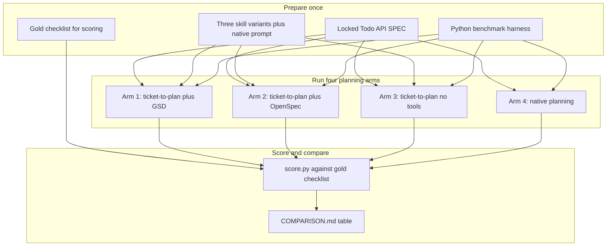
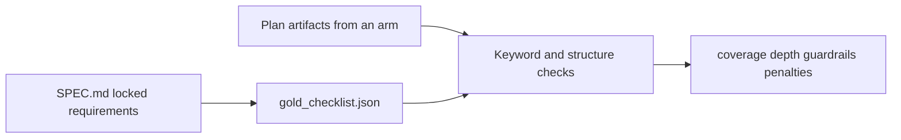
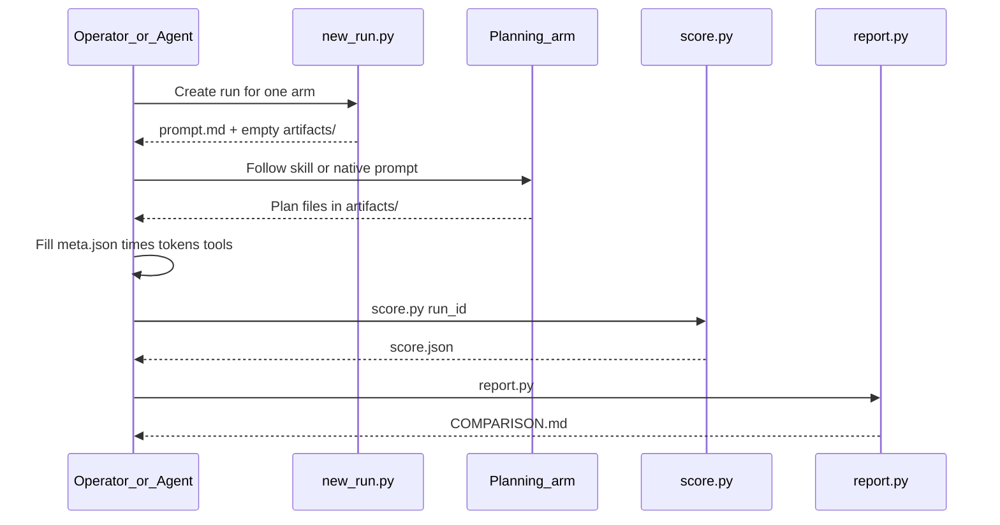
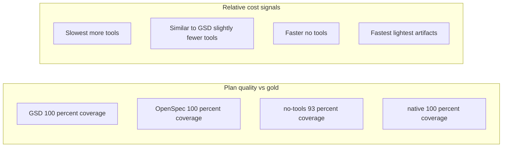
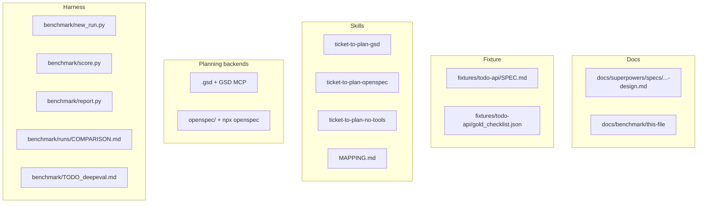

# ticket-to-plan × OpenSpec Benchmark — Full Explanation

**Audience:** Team meeting (can we use ticket-to-plan with OpenSpec?)  
**Date:** 2026-07-30  
**Repo:** `openspec-test`  
**Later:** 3–5 slide deck from this doc (pptx skill + your template)

---

## 1. What question were we answering?

We wanted a fair, apples-to-apples answer to:

> Does **ticket-to-plan** still work well if we replace its **GSD** planning backend with **OpenSpec**?

To make that honest, we also compared against two baselines:

1. The same ticket-to-plan *process*, but **without** GSD or OpenSpec (plain markdown plans)
2. **Native AI planning** (no ticket-to-plan skill at all)

So the real question for leadership is not only “OpenSpec vs GSD,” but also “does the skill add value over raw AI planning?”

---

## 2. Big picture (one diagram)

**Plain English:**  
Same input spec → four different ways of writing a plan → same scoring rules → one comparison table.

We did **not** build the Todo app in this phase. We only scored the **plans**.

---

## 3. What we held constant (fairness rules)

| Rule | Why it matters |
| --- | --- |
| One locked SPEC for every arm | Differences come from *how* we plan, not *what* we were asked to build |
| Fully specified requirements (no live grilling) | ticket-to-plan would otherwise ask clarifying questions and burn extra time/tokens unevenly |
| Rubric-only accuracy (no “implement and see if it works”) | Isolates planning quality from coding skill |
| Same metrics for every arm | Comparable numbers |
| OpenSpec installed **alongside** GSD (not replacing it) | Arm 1 still needs GSD; Arm 2 needs OpenSpec |

---

## 4. The fixture (what everyone planned)

We invented a small greenfield app used only as a planning target:

**Rust HTTP Todo API** (Axum + SQLite via sqlx, no UI)

Locked in [`fixtures/todo-api/SPEC.md`](../../fixtures/todo-api/SPEC.md):

- Model: `id`, `title`, `completed`, `created_at`, `updated_at`
- Endpoints: create / list (+ filter) / get / patch / delete + `/health`
- Validation, JSON error shape, migrations, required tests
- Explicit **out of scope**: auth, UI, pagination, Docker/K8s, GraphQL, etc.

Scoring truth lives in:

- [`fixtures/todo-api/GOLD_RUBRIC.md`](../../fixtures/todo-api/GOLD_RUBRIC.md)
- [`fixtures/todo-api/gold_checklist.json`](../../fixtures/todo-api/gold_checklist.json)

---

## 5. The four arms (what we compared)

```mermaid
flowchart TB
  subgraph arm1 [Arm 1 — GSD]
    S1[skills/ticket-to-plan-gsd]
    B1[GSD MCP gsd_plan_*]
    O1[.gsd phases ROADMAP and slice PLANs]
    S1 --> B1 --> O1
  end

  subgraph arm2 [Arm 2 — OpenSpec]
    S2[skills/ticket-to-plan-openspec]
    B2[OpenSpec CLI / opsx]
    O2[openspec/changes/... proposal specs design tasks]
    S2 --> B2 --> O2
  end

  subgraph arm3 [Arm 3 — no-tools]
    S3[skills/ticket-to-plan-no-tools]
    O3[Hand-written ROADMAP + slice PLAN markdown]
    S3 --> O3
  end

  subgraph arm4 [Arm 4 — native]
    S4[No skill]
    O4[One free-form PLAN.md]
    S4 --> O4
  end
```

### Arm 1 — Original ticket-to-plan + GSD

- Skill: `skills/ticket-to-plan-gsd/SKILL.md` (preserved copy of the original)
- Backend: GSD workflow MCP (`gsd_plan_milestone`, `gsd_plan_slice`, …)
- Output shape: milestone → slices → tasks in `.gsd/phases/...`
- Also fills **Delivery & Guardrails** (commit rules, handoff gate, etc.)

### Arm 2 — ticket-to-plan + OpenSpec (thin adapter)

- Skill: `skills/ticket-to-plan-openspec/SKILL.md`
- **Same process steps** as the GSD skill (read context → ambiguity gate → full plan depth → delivery map → approval stop)
- **Different backend:** OpenSpec change folder instead of GSD DB/MCP
- Mapping documented in [`skills/MAPPING.md`](../../skills/MAPPING.md)

| GSD idea | OpenSpec idea |
| --- | --- |
| Milestone / phase (`M001`) | Change folder `openspec/changes/<name>/` |
| Slice | Section / group in `tasks.md` |
| Task | Checkbox in `tasks.md` |
| ROADMAP + Delivery section | `proposal.md` / `design.md` + Delivery & Guardrails |
| `gsd_plan_*` tools | `npx openspec` / `/opsx-propose` |

### Arm 3 — ticket-to-plan process, no planning tools

- Same gates and Delivery & Guardrails idea
- Writes markdown only under the run’s `artifacts/` folder
- Proves how much of the skill’s value is **process**, not the tool

### Arm 4 — Native planning

- Prompt = locked SPEC + “write a complete implementation plan”
- No ticket-to-plan skill, no GSD, no OpenSpec
- Control group: “just ask the model”

---

## 6. How OpenSpec was installed in this repo

- Package: `@fission-ai/openspec` as a **local** npm dependency (`npx openspec`)
- Init: `openspec init --tools cursor` → Cursor commands under `.cursor/commands/` (`opsx-propose`, etc.)
- Layout: `openspec/config.yaml`, `openspec/changes/`, `openspec/specs/`
- **GSD left in place** (`.gsd/` still exists for Arm 1)

Note: a global `npm install -g` was avoided; local + `npx` is enough for this workspace.

---

## 7. The harness (how a run works)

Tools live under [`benchmark/`](../../benchmark/):

| Script | Job |
| --- | --- |
| `new_run.py --arm …` | Creates `runs/<run_id>/` with `prompt.md`, `meta.json`, empty `artifacts/` |
| Operator / agent plans | Writes plan files into `artifacts/` |
| Fill `meta.json` | Wall-clock, tokens (best-effort), tool-call count |
| `score.py <run_id>` | Scores artifacts vs gold checklist → `score.json` |
| `report.py` | Builds `COMPARISON.md` (+ optional CSV) |

### Metrics we scored

| Metric | Meaning in plain language |
| --- | --- |
| Wall-clock | How long planning took (start → plan ready) |
| Tokens | How “big” the context/output felt (best-effort; see caveats) |
| Requirement coverage | Did the plan mention the locked SPEC pieces? |
| Plan depth | Did it have full structure (slices/tasks or OpenSpec artifacts)? |
| Guardrail fidelity | Did ticket-to-plan arms cite delivery/handoff/commit rules? |
| Tool-call burden | How many MCP/CLI calls |
| Artifact bulk | How many files / how many bytes |
| Hallucination penalty | Did it treat out-of-scope items (auth, UI, …) as required work? |
| Over-planning penalty | Extra work beyond the gold scope |

DeepEval (automated LLM judges) is **documented only** for a later project: [`benchmark/TODO_deepeval.md`](../../benchmark/TODO_deepeval.md).

---

## 8. What we actually ran (v1 baseline)

Four runs:

| Arm | Run id |
| --- | --- |
| GSD | `bench-todo-gsd-r1` |
| OpenSpec | `bench-todo-openspec-r1` |
| no-tools | `bench-todo-no-tools-r1` |
| native | `bench-todo-native-r1` |

### Important honesty note (for the deck)

These v1 runs were produced **in one implementation session** to prove the pipeline end-to-end:

- GSD arm used **real** GSD MCP planning calls
- OpenSpec arm used **real** `npx openspec new change` + authored change files
- no-tools / native wrote markdown into run folders
- Wall-clock and tokens are **instrumented estimates** (`tokens.source = estimate_chars`), not Cursor billing UI numbers

See [`benchmark/runs/NOTES.md`](../../benchmark/runs/NOTES.md).

For a **production team claim**, re-run each arm in a separate Cursor chat, fill `meta.json` from real session timing/usage, then re-score.

---

## 9. Results (v1)

From [`benchmark/runs/COMPARISON.md`](../../benchmark/runs/COMPARISON.md):

| Arm | Wall (s) | Tokens* | Tools | Coverage | Depth | Guardrails | Halluc. | Overplan |
| --- | --- | --- | --- | --- | --- | --- | --- | --- |
| **gsd** | 180 | 3698 | 4 | 1.00 | 1.00 | 1.00 | 0 | 0 |
| **openspec** | 150 | 3634 | 3 | 1.00 | 1.00 | 1.00 | 0 | 0 |
| **no-tools** | 90 | 2935 | 0 | 0.93 | 1.00 | 1.00 | 0 | 0 |
| **native** | 60 | 2108 | 0 | 1.00 | 1.00 | N/A | 0 | 0 |

\* Estimated from character volume, not official Cursor token meters.

### How to read this for the meeting

**OpenSpec + ticket-to-plan looks viable in v1:**

- Same full requirement coverage and depth as GSD
- Same guardrail fidelity (Delivery & Guardrails present)
- Similar bulk and token estimate; slightly fewer tool calls and slightly less wall time in this run

**Native planning looked “good” on keyword coverage too** — for a *fully locked* small SPEC, a model can list the right endpoints without the skill. That does **not** mean native planning matches ticket-to-plan on:

- Delivery / commit / handoff discipline
- Stable artifact layout for later agents
- Multi-ticket / multi-repo / ambiguous work (not tested here)

**no-tools** kept the process and guardrails but missed a bit of checklist coverage (0.93) — process without a structured backend can drift.

---

## 10. Pros of ticket-to-plan + OpenSpec (talking points)

1. **Drop-in process** — thin adapter keeps grilling gates, full plan depth, approval-before-execute, Delivery & Guardrails.
2. **Portable artifacts** — OpenSpec’s `proposal / specs / design / tasks` are plain markdown teams already understand; works with Cursor `/opsx-*`.
3. **Coexistence** — GSD and OpenSpec can live in one repo during migration; no forced rip-and-replace.
4. **Comparable quality (v1)** — On this locked Todo API fixture, OpenSpec arm matched GSD on coverage/depth/guardrails/penalties.
5. **Clear mapping** — `skills/MAPPING.md` makes the GSD→OpenSpec translation teachable.

---

## 11. Cons and risks (talking points — be explicit in the deck)

> **How we close these (not narrative):** see frozen [`PROTOCOL.md`](PROTOCOL.md) (abp-v1) — n=3, F1+F2, blind human S2 + DeepEval S3, TikToken cost signals, execute-to-score, pre-registered pass rules. Current [`benchmark/runs/bench-todo-*`](../../benchmark/runs/) results are **[`v0-EXPLORATORY`](v0-EXPLORATORY.md)** only. Decision-grade claims require [`ACCEPTANCE_REPORT.md`](ACCEPTANCE_REPORT.md).

### A. Measurement caveats

- **n=1** only; no variance / statistical claim yet (schema supports repeats).
- Tokens are **best-effort**, not billing-accurate.
- v1 runs were **not** four independent operator Cursor sessions.
- Scoring is **keyword/heuristic**, not human review or DeepEval LLM judges yet.
- We scored **plans**, not whether following the plan ships a correct API.

### B. Product / process cons of OpenSpec vs GSD (for this skill)

| Topic | Con |
| --- | --- |
| Milestone IDs | OpenSpec uses change folder names, not `M001`/`S01` DB ids — handoff scripts that assume GSD ids need rewriting |
| Delivery profile | Still leaned on `.gsd/DELIVERY-PROFILE.md` for integration/commit vocabulary; OpenSpec does not replace delivery policy |
| Guardrail sources | Some citations still point at GSD workflow files; pure OpenSpec shops need OpenSpec-native sources |
| Tooling maturity in-repo | Local `npx openspec` vs global CLI; team must standardize install |
| Apply path | OpenSpec `/opsx-apply` ≠ GSD `do next` / `gsd_task_complete` — execution agents need different instructions |
| Dual systems | Keeping both GSD and OpenSpec long-term increases cognitive load |

### C. When OpenSpec + ticket-to-plan may *not* be enough

- Ambiguous tickets (grilling time dominates; not measured here)
- Execute-and-verify accuracy (not in v1)
- Teams that need GSD’s DB/progress/UAT machinery as the system of record
- Large multi-milestone workstreams where GSD’s size budgets / workstream model are load-bearing

### D. Baseline interpretation risk

Native planning can look strong on a **tiny locked SPEC**. Do not conclude “skills are useless” from Arm 4 alone. The skill’s value shows up more in:

- Ambiguity handling
- Guardrails / delivery discipline
- Consistent artifacts for the *next* agent
- Bigger or messier tickets

---

## 12. Recommended meeting narrative (3–5 slides later)

Suggested story arc for the pptx (when you’re ready):

1. **Problem** — We rely on ticket-to-plan + GSD; can OpenSpec be the planning backend instead?
2. **Method** — Same locked Rust Todo API SPEC; four arms; rubric scoring; what we did *not* measure.
3. **Result** — OpenSpec thin adapter matched GSD quality signals in v1; native looked competitive on coverage only.
4. **Cons / caveats** — n=1, estimated tokens, plan-only, dual-tool coexistence costs.
5. **Ask** — Approve a second round (separate Cursor sessions, n≥3, optional DeepEval) before adopting OpenSpec as default.

---

## 13. Where everything lives (file map)

---

## 14. Bottom line

**For the team question “does ticket-to-plan work with OpenSpec?”**

- **Yes, as a thin adapter:** same skill steps, OpenSpec artifacts, quality metrics on this fixture matched GSD.
- **Not a blank check:** caveats around measurement, execution workflows, dual systems, and native-looking-good-on-easy-specs must be stated clearly.
- **Next proof:** operator-run sessions, more replicates, and optionally DeepEval / implement-from-plan scoring.

When you want the deck, share the template and we can turn Sections 10–12 into 3–5 slides with the pptx skill.
